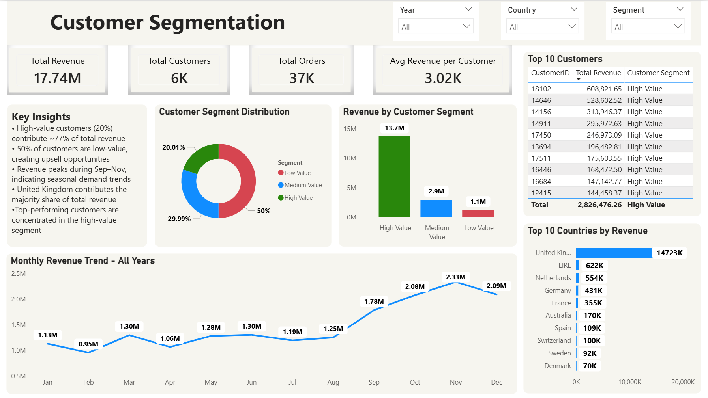

# Customer Segmentation Analysis | Excel + SQL + Power BI

## Overview

This project analyzes customer purchasing behavior, revenue contribution and customer segments using the Online Retail Dataset.

The workflow combines Excel, SQL and Power BI to perform data consolidation, cleaning, transformation, data modeling, customer segmentation and interactive dashboard visualization.

Customers were segmented into **High Value, Medium Value and Low Value** groups based on revenue contribution using percentile-based segmentation logic (P50 and P80 thresholds).

The dashboard provides insights into:
- High-value customers driving revenue
- Revenue contribution by customer segments
- Monthly revenue trends and seasonality
- Top customers and countries by revenue

---

## Objective

- Segment customers based on revenue contribution
- Identify high-value customers driving the majority of business revenue
- Analyze customer distribution across different value segments
- Monitor monthly revenue trends and seasonal patterns
- Discover top-performing countries and customers

---

## Business Problem

Businesses often struggle to identify:
- Customers generating the highest revenue
- Customer segments requiring retention or upselling strategies
- Countries contributing the most to overall sales
- Seasonal revenue trends affecting business performance

This project addresses these challenges through customer segmentation and revenue analysis using interactive Power BI visualizations.

---

## Dataset

**Dataset Source:** https://archive.ics.uci.edu/dataset/502/online+retail+ii

### Key Columns
- InvoiceNo
- StockCode
- Description
- Quantity
- InvoiceDate
- UnitPrice
- CustomerID
- Country
- Revenue

---

## Tools & Technologies

- **Excel** → Data consolidation and CSV preparation
- **SQL (MySQL)** → Data cleaning and transformation
- **Power BI** → Data modeling and dashboard development
- **DAX** → KPI and customer segmentation calculations

---

## Data Preparation & Workflow

### Excel
- Merged yearly sheets (2009–2010 and 2010–2011)
- Consolidated raw transactional data
- Converted `.xlsx` dataset into `.csv` format for MySQL ingestion

### SQL
- Imported CSV data into MySQL
- Removed:
  - Null customer IDs
  - Negative quantities
  - Invalid unit prices
  - Cancelled invoices
- Created revenue column for analysis

### Power BI
- Designed a star schema data model with fact and dimension tables for optimized filtering and analysis
- Developed DAX measures for KPIs and customer segmentation
- Implemented customer segmentation logic using revenue percentile thresholds (P50 & P80) to classify customers into High, Medium and Low Value segments
- Built an interactive dashboard for revenue and customer analysis

---

## Important SQL Operations

```sql
CREATE TABLE online_retail_clean AS
SELECT *
FROM online_retail
WHERE Quantity > 0
AND UnitPrice > 0
AND InvoiceNo NOT LIKE 'C%'
AND CustomerID IS NOT NULL;

ALTER TABLE online_retail_clean
ADD COLUMN Revenue DECIMAL(12,2);

UPDATE online_retail_clean
SET Revenue = Quantity * UnitPrice;
```

---

## Key Insights

- High-value customers (~20%) contribute nearly 77% of total revenue
- Around 50% of customers belong to the low-value segment
- Revenue peaks during September–November, indicating seasonal demand
- The United Kingdom generates the highest revenue contribution
- Revenue is heavily concentrated among top-performing customers

---

## Dashboard Features

- KPI Cards
- Customer Segment Distribution
- Revenue by Customer Segment
- Monthly Revenue Trend
- Top Customers by Revenue
- Top Countries by Revenue
- Interactive Filters & Slicers

---

## Dashboard Preview



---

## How to Run This Project

1. Run the SQL script:
   - `customer_segmentation_data_preparation.sql`

2. Open:
   - `customer_segmentation_dashboard.pbix`

3. Refresh the Power BI data connection.

---

## Final Recommendations

- Prioritize retention strategies for high-value customers
- Target medium-value customers with upselling campaigns
- Improve engagement for low-value customers
- Increase focus during seasonal revenue peaks

---

## Author

**Anshul Sajwan**

- LinkedIn: linkedin.com/in/anshul-sajwan
- Email: anshulsajwan.32@gmail.com